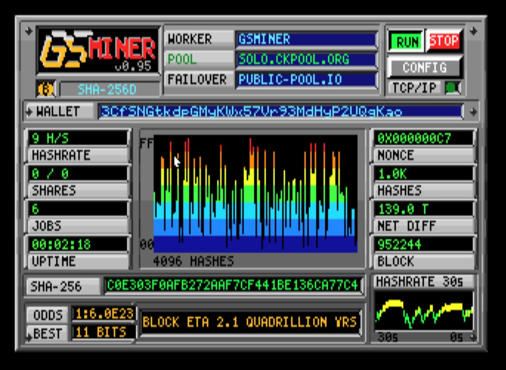
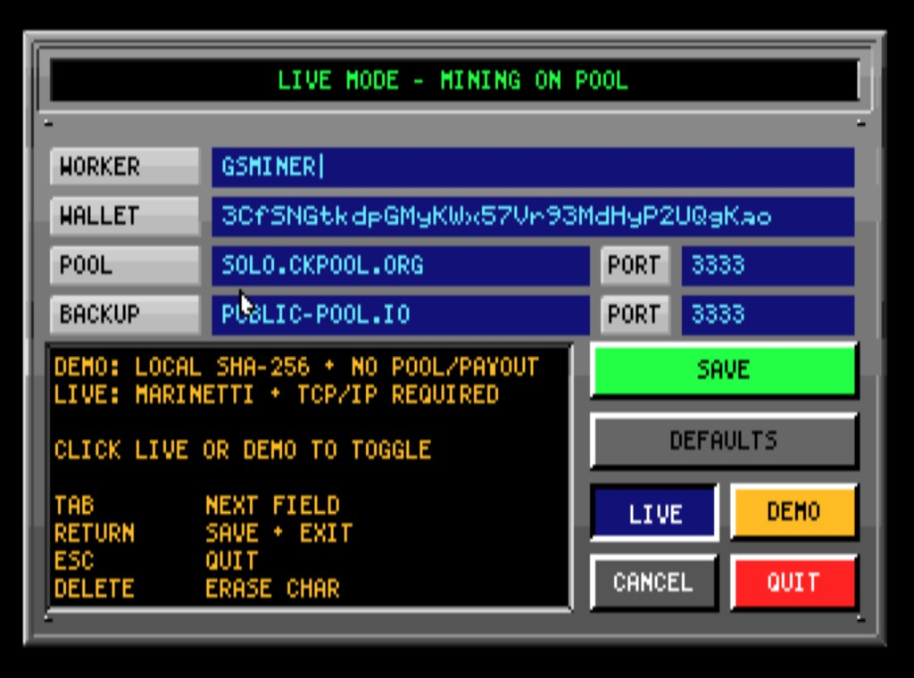

# GS Miner

Got a few quadrillion years to kill? **GS Miner** is a GS/OS application for the Apple IIGS that connects to a **real Bitcoin Stratum pool** over Marinetti TCP, pulls live jobs, and runs **SHA-256d** on block headers while a live dashboard shows HASHRATE, NET DIFF, block height, JOBS, and a BLOCK ETA measured in **quadrillions of years** (~9–10 H/s on a stock 2.8 MHz GS).

Inspired by Charles Mangin’s Apple IIe [**8BITCOIN**](https://retroconnector.com/2019/08/13/mining-bitcoin-on-an-apple-ii-a-highly-impractical-guide/) (2019), built for the GS as a full app for the machine’s 40th anniversary year. **Not a retirement plan.**





> **Beta — `GSMINE95` (V0.95), 2026-06-03 — gold master.** 🏆 First confirmed LIVE mining on real Apple IIgs hardware (14 MHz TWGS + Uthernet II on `solo.ckpool.org`). Shippable 2IMG / CFFA-mountable `GSMINER` disk, long soaks stable (~9–10 H/s stock 2.8 MHz, ~21 H/s on the 14 MHz GS). **Source code** posted in a few days after final doc/baseline cleanup — the release disk runs now.
>
> **Done:** user README, submit-filtering docs, Finder icon, `SYSFILES/` layout, live NET DIFF/BLOCK/JOBS, **in-app gold GS / red MINER logo** (rendered at runtime into the SHR logo well with a dynamic version stamp), portable app-relative paths, 2IMG/CFFA gold-master `GSMINER` disk, **first live mining on real hardware**. **Next:** GitHub source drop + announcement post.

📖 **Read the full story** — background, architecture deep-dives, milestone-by-milestone build, the revisions, and the war stories: **[`WRITEUP.md`](WRITEUP.md)**.

---

## Download

| Asset | Description |
|-------|-------------|
| **[Latest release disk](releases/)** | ProDOS `2MG` image — mount or write to media, boot GS/OS, open `/GSMINER/GSMINE95` (rev may vary) |
| **`mock_pool.py`** | Mac-side Stratum pool for LAN testing (optional) |
| **`dump_minerlog.sh`** | Pull diagnostic logs off the disk image (host Mac, requires Java + AppleCommander) |

---

## Requirements

- **Apple IIGS** with **GS/OS**
- **Marinetti TCP/IP** installed and connected (Uthernet II, or an emulator with working TCP — e.g. Ample/MAME with Marinetti configured)
- For **LIVE mode:** pool hostname/IP, port, worker name, and wallet (payout address) in CONFIG

---

## Quick start

1. **Get the disk** — download the release `.2mg` from [Releases](releases/) (or GitHub Releases when published).
2. **Mount** the image in your emulator, or inject/copy onto your boot media.
3. **Boot GS/OS** and open **`/GSMINER/GSMINE95`** (or the current rev on the disk).
4. **DEMO mode (default)** — runs immediately: full mining loop + dashboard, no network. Good if you have no TCP or just want to watch hashes and the scope.
5. **LIVE mode** — click **CONFIG**, set MODE to `LIVE`, enter pool/worker/wallet (and optional backup pool), save, return to the panel, click **RUN**. The app connects via Marinetti, subscribes to Stratum, and hashes live jobs.

### Disk layout

```
/GSMINER/
  GSMINE95          ← GS Miner app (S16)
  SYSFILES/
    PANEL           ← SHR dashboard chrome
    CONFIG          ← CONFIG page chrome
    MINER.CONF      ← your settings (created on save)
    MINER.LOG       ← diagnostic log (current session)
    MINER.OLD       ← previous log block (rotating, ~8 KB each)
  Icons/
    GSMINER.ICONS   ← Finder icon
```

---

## LIVE vs DEMO

| | **DEMO** | **LIVE** |
|---|----------|----------|
| Network | None | Marinetti TCP → Stratum pool |
| Jobs | Embedded demo job | `mining.notify` from pool |
| NET DIFF / BLOCK | Illustrative constants | Decoded from live job (`nbits`, coinbase) |
| Hashing | Real SHA-256d loop | Real SHA-256d on **live block headers** |
| `mining.submit` | Never | Only when hash beats the **pool share target** (see below) |

---

## Is this really mining?

**Yes — the work is real.** In LIVE mode the GS subscribes to Stratum, receives the same kind of jobs as any other miner, builds the **80-byte block header** (coinbase, merkle branch, nbits, ntime, nonce), and runs **SHA-256d** on it. HASHRATE, JOBS, NET DIFF, and BLOCK ETA all come from that live loop.

**Submitting shares is a separate step.** A pool only wants `mining.submit` when your hash clears **their** difficulty (`mining.set_difficulty`) — not when you find an “interesting” hash with a couple of zero bytes (Charles Mangin’s [8BITCOIN](https://retroconnector.com/2019/08/13/mining-bitcoin-on-an-apple-ii-a-highly-impractical-guide/) celebrated those locally; pools reject them).

### Filtering, not a hard “no submit” on public pools

There is **no** code path that says “public hostname → never call `mining.submit`.” The gate is **hygiene**: only submit hashes we believe the pool will accept.

Each nonce is scored by **leading zero bits** in the SHA-256d digest. In LIVE mode, `mining.submit` runs only when:

```text
leading_zero_bits(hash) >= strat_need_bits()
```

On a **public** pool, `strat_need_bits()` is whatever the pool sent in `mining.set_difficulty` (typically **≥ 32 bits** when difficulty ≥ 1). On a **LAN / private IP** (mock pool), the app uses an **8-bit** easy target so you can demo `ACCEPT` — that override applies only to private addresses.

So if you **do** find a hash that clears the pool bar — on real hardware, or a turbo emulator — **the submit goes out** and the pool can accept it. Stock ~10 H/s just never gets there often enough to notice.

### Why you often see `0 / 0` shares on a public pool

| Pool type | Share target | At ~10 H/s (stock 2.8 MHz) |
|-----------|--------------|----------------------------|
| **Public** (e.g. ckpool.org hostname) | From `set_difficulty` — **≥ 32 bits** at diff ≥ 1; ckpool soaks have seen **~45 bits** | Target is **effectively unreachable** → worker connects and hashes, SHARES stay `0 / 0` |
| **LAN / private IP** (e.g. `192.168.x.x`, mock pool) | Easy dev target (**8 bits** — one zero byte) | Shares in seconds → **`ACCEPT`** in the log |

That silence on SHARES is **probability**, not the app refusing to mine or submit.

### How many hashes to “win the share lottery”?

Each hash is roughly a fair coin flip. Need **≥ N** leading zero bits → expect about **2^N** tries on average:

| Target | Expected hashes | ~10 H/s (stock GS) | ~1 kH/s (hypothetical “turbo” GS*) |
|--------|-----------------|--------------------|-------------------------------------|
| **32 bits** (diff ≈ 1) | ~4.3 billion | ~**14 years** avg | ~**50 days** avg |
| **45 bits** (seen on ckpool) | ~35 trillion | ~**110,000 years** avg | ~**1,100 years** avg |

\*Rough scaling only: if SHA-256d throughput scaled linearly with clock, 300 MHz vs 2.8 MHz ≈ **100×** → ~**1,000 H/s**. Still tiny vs a modern ASIC, but a fast emulator pointed at a **public** hostname would play by the same rules — hit the target, get a submit; miss it, stay quiet.

### Why not submit “interesting” weak hashes anyway?

If we submitted every hash with a few zero bytes (the 8BITCOIN-style celebration threshold):

- The pool would **`reject`** almost every share (`result: false`).
- At ~10 H/s you could still flood the pool with **useless traffic** (JSON + verification load).
- Many pools **rate-limit, disconnect, or ban** misbehaving workers.

We filter out shares **we know will fail** rather than spam rejects. For a demo where you want **`ACCEPT`** quickly, use **`mock_pool.py`** on your LAN.

**Bottom line:** LIVE mode is real Stratum mining. The submit gate is **pool-target filtering**, not “fake mining.” BLOCK ETA still uses **network** difficulty (the quadrillion-year lottery Mangin wrote about).

---

## CONFIG fields

| Field | Purpose |
|-------|---------|
| **MODE** | `DEMO` or `LIVE` |
| **WORKER** | Stratum worker name (e.g. `GSMINER`) |
| **WALLET** | Payout address (Stratum username) |
| **POOL** / **PORT** | Primary Stratum host and port |
| **BACKUP** / **BPORT** | Failover pool (optional) |

Settings persist to `/GSMINER/SYSFILES/MINER.CONF`.

**Default shipping config** uses a placeholder wallet and `SOLO.CKPOOL.ORG` — change it before LIVE mining, or treat it as an easter egg and point at your own pool.

---

## Mock pool (LAN testing)

For development and “show me an accepted share” demos on your Mac:

```bash
python3 mock_pool.py
```

Point the GS CONFIG at your Mac’s LAN IP (often `192.168.x.1` on Ample vmnet) port **3333**. The mock pool speaks real Stratum v1 and **re-verifies every share in Python** — it doubles as a correctness oracle for the GS hashing path.

See the header comment in `mock_pool.py` for the 80-byte block header layout the GS must build.

---

## Diagnostic logs

The app writes event-driven lines to rotating logs (never inside the hash loop):

- `/GSMINER/SYSFILES/MINER.LOG` — current session  
- `/GSMINER/SYSFILES/MINER.OLD` — previous ~8 KB block  

Examples: `CONNECT`, `JOB`, `STAT`, `ACCEPT`, `FAILOVER`, `DNS!`, `MINING`.

On the host (eject the floppy in the emulator first):

```bash
./dump_minerlog.sh        # print logs to terminal
./dump_minerlog.sh -s     # also save under ./logs/
```

Requires `AppleCommander.jar` in the repo root (bring your own if not redistributed).

---

## Features

- **Live Stratum** — subscribe, authorize, notify, submit over one TCP socket  
- **Primary + backup pool failover**  
- **SHA-256d** with **midstate** (~2 compressions per nonce) via Stephen Heumann’s **65816-crypto**  
- **SHR dashboard** — hashrate graph, hash scope, live NET DIFF / BLOCK / JOBS / BLOCK ETA  
- **CONFIG** persistence, mining **log**, TCP status lamp  
- **DEMO mode** — full UI without TCP  

---

## How it works (short)

| Layer | What happens |
|-------|----------------|
| **Network** | Marinetti TCP → Stratum JSON lines |
| **Job → header** | Coinbase + extranonce → merkle root → 80-byte header |
| **Hash loop** | Midstate on block 0; per-nonce finish + second SHA-256 |
| **Crypto** | `lib65816hash` (`sha256_processblock` in the hot path) |
| **UI** | Cooperative loop: hash + periodic SHR redraw |

Full architecture notes will ship with the source drop (`docs/` / build history).

---

## Building from source

**Coming in a few days** with the full repository: `miner/` sources, patched `65816-crypto/`, build scripts (`inject_gsminer.sh`, `make_master.sh`), and offline tests (`mstest`, `bench`, `livetest`).

**Not required to run the release disk** — only if you want to compile from source on a Mac.

| Piece | Role |
|-------|------|
| [**Golden Gate**](http://golden-gate.ksherlock.com/) | Runs ORCA command-line tools natively on macOS (65816 emulator + GS/OS glue) |
| [**Opus ][: The Software**](https://juiced.gs/) | ORCA/M, ORCA/C 2.1 base, linker, libraries, manuals (Juiced.GS / Gamebits) |
| [**ORCA/C 2.2+**](https://github.com/byteworksinc/ORCA-C) | Free updates on top of the Opus ][ base (Byteworks) |
| **Marinetti** | GS/OS TCP/IP — same stack the app uses at runtime |
| **AppleCommander** | Host-side `.2mg` inject / log extract (bring your own JAR) |

GS Miner is built with **ORCA/C** (large memory model, `occ -b`), linking **ORCA/M** assembly from `65816-crypto`. Edit on the Mac, build with `occ`, run the resulting `.S16` on real hardware or in an emulator.

---

## Credits

### Runtime (the app on your GS)

- [**65816-crypto**](https://github.com/sheumann/65816-crypto) — Stephen Heumann (SHA-256 and related 65816 crypto)
- [**8BITCOIN**](https://github.com/option8/8BITCOIN) — Charles Mangin / [RetroConnector](https://retroconnector.com/) (Apple IIe mining lineage)
- **Marinetti** — Apple IIgs TCP/IP stack (Liveware / community ports; required for LIVE mode)

### Build toolchain (source builders — purchased / installed for this project)

- [**Golden Gate**](http://golden-gate.ksherlock.com/) — Kelvin Sherlock; macOS host layer for IIgs CLI tools
- [**Opus ][: The Software**](https://juiced.gs/) — ORCA/M, ORCA/C, linker, and ORCA libraries (Juiced.GS / Gamebits / Byteworks)
- [**ORCA/C**](https://github.com/byteworksinc/ORCA-C) — Mike Westerfield / Byteworks (compiler updates used with the Opus ][ base)

### Host utilities

- **AppleCommander** — disk image inject and log extraction on the Mac (not bundled in this repo)

Implementation driven and tested on real/emulated hardware; modern coding assistants used heavily for development. Issues and optimizations welcome once source is posted.

---

## Disclaimer

This is a hobby / demonstration project. It does not provide financial advice. You will not mine profitable Bitcoin on a IIgs. Have fun.

---

## Internal / release notes

The full narrative write-up (background, architecture, milestones, revs, war stories): [`WRITEUP.md`](WRITEUP.md)

Deep technical history, milestones, submit-filtering detail: [`IIGS_BITCOIN_MINER_POC.md`](IIGS_BITCOIN_MINER_POC.md) (§16i)
