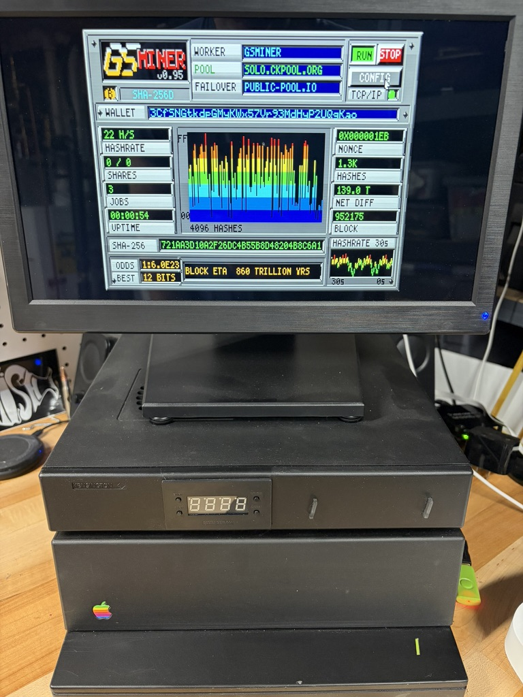

# GS Miner

Got a few quadrillion years to kill? **GS Miner** is a GS/OS application for the Apple IIGS that connects to a **real Bitcoin Stratum pool** over Marinetti TCP, pulls live jobs, and runs **SHA-256d** on block headers while a live dashboard shows HASHRATE, NET DIFF, block height, JOBS, and a BLOCK ETA measured in **quadrillions of years** (~9–10 H/s on a stock 2.8 MHz GS).

Inspired by Charles Mangin’s Apple IIe [**8BITCOIN**](https://retroconnector.com/2019/08/13/mining-bitcoin-on-an-apple-ii-a-highly-impractical-guide/) (2019), built for the GS as a full app for the machine’s 40th anniversary year. **Not a retirement plan.**




*Live on real iron: **22 H/s** on a modded ROM 3 “Dark” Apple IIgs — TransWarp GS (clocked to 14 MHz), Uthernet II, CFFA, 8 MB RAM, VidHD — mining `solo.ckpool.org`. The 22 H/s above is **measured, not estimated**.*

> **Beta — `GSMINE95` (V0.95), 2026-06-03 — gold master.** 🏆 First confirmed LIVE mining on real Apple IIgs hardware. Shippable 2IMG / CFFA-mountable `GSMINER` disk, long soaks stable. **Measured ~9–10 H/s on a stock 2.8 MHz GS; 22 H/s on a 14 MHz TransWarp GS** (modded ROM 3 rig: TWGS + Uthernet II + CFFA + 8 MB + VidHD, on `solo.ckpool.org`). Full source, build scripts, and docs are in this repo; the release disk runs now.

📖 **Read the full story** — background, architecture deep-dives, milestone-by-milestone build, the revisions, and the war stories: **[`WRITEUP.md`](WRITEUP.md)**.

---

## Features

GS Miner is a **complete, full-stack application**, not a tech demo. It boots, configures, networks, mines, visualizes, and logs — and the same binary runs on **any** Apple IIGS or emulator, network or not.

**Runs anywhere**
- **DEMO mode (default)** — boots straight into the full dashboard and a real local SHA-256d loop on **any GS or emulator, no network required**. Watch the spectrum, scope, and graphs immediately.
- **Portable install** — the app resolves its data (`SYSFILES/`) relative to wherever it is launched (GS/OS prefix `1/`, with volume fallbacks), so the **binary + `SYSFILES/` + `Icons/` run from any folder on any volume**, not just the shipped `GSMINER` disk.
- **Custom Finder icon set** — a color (`$CA`) coin icon for the app and its files on the GS/OS desktop.

**Networking & mining (LIVE)**
- **Live Stratum v1** over Marinetti TCP — `subscribe` / `authorize` / `notify` / `submit` on one socket; loads and starts Marinetti itself if it isn't already up.
- **Pool by IP *or* hostname** with **full DNS name resolution** (`TCPIPDNRNameToIP`).
- **Primary + backup pool failover** with retry/backoff and prefer-primary re-probe.
- **SHA-256d** with the **midstate** optimization (~2 compressions per nonce) via Stephen Heumann’s hand-tuned **65816-crypto** assembly.
- **Real work, pool-target submit filtering** — honest hashing; only plausible shares would be submitted (hygiene, not fake mining — see [Is this really mining?](#is-this-really-mining)).

**Operator controls**
- **CONFIG page** — editable WORKER / WALLET / POOL+PORT / BACKUP+PORT and a **DEMO/LIVE toggle**, with SAVE / DEFAULTS / CANCEL / QUIT; persists to `MINER.CONF`.
- **Start / Stop** mining on demand, fully **mouse-driven** (self-drawn cursor; clickable RUN / STOP / CONFIG).
- **Intelligent status badge** on the main page — *connecting, resolving, retry, no IP, no Marinetti, pool fail, DNS fail, hashing,* etc. — so you always know exactly what the stack is doing.
- **Expanded status** on the CONFIG page — full-sentence explanations of each state plus hints.

**Live visualization (SHR dashboard)**
- **Hash spectrum analyzer** — a rainbow oscilloscope driven by **real SHA-256d digest bytes** (each bar is an output byte of the live hash), so it’s an honest view of the work, not eye-candy.
- **Live hashrate graph** — a rolling ~30-second VU/line chart of measured H/s.
- **Active live readouts** — HASHRATE, SHARES (acc/rej), JOBS, UPTIME, NONCE, HASHES, plus **live NET DIFF** (decoded from `nBits`) and **BLOCK height** (BIP34, from the coinbase).
- **Dynamic odds + BLOCK ETA** — block-finding odds and time-to-block computed live from network difficulty ÷ measured hashrate (yes, the quadrillion-years number is real math).
- **Dynamic TCP link lamp** — grey / red / green link state that **pulses on live TX/RX traffic**.

**Diagnostics**
- **On-disk diagnostic logging** — event-driven, timestamped, rotating logs you can pull off the disk and parse on the host (see [Diagnostic logs](#diagnostic-logs)).

> *Planned:* an Ensoniq DOC soundtrack with a mute toggle. Sound/music is still TBD and can be added later without touching the mining stack.

---

## Download

| Asset | Description |
|-------|-------------|
| **[Latest release disk](releases/)** | ProDOS `2MG` image — mount or write to media, boot GS/OS, open `/GSMINER/GSMINE95` (rev may vary) |
| **`mock_pool.py`** | Mac-side Stratum pool for LAN testing (optional) |
| **`dump_minerlog.sh`** | Pull diagnostic logs off the disk image (host Mac, requires Java + AppleCommander) |

---

## Requirements

- **Apple IIGS** with **GS/OS**
- **Marinetti TCP/IP** installed and connected (Uthernet II, or an emulator with working TCP — e.g. Ample/MAME with Marinetti configured)
- For **LIVE mode:** pool hostname/IP, port, worker name, and wallet (payout address) in CONFIG

---

## Quick start

1. **Get the disk** — download the release `.2mg` from [Releases](releases/) (or GitHub Releases when published).
2. **Mount** the image in your emulator, or inject/copy onto your boot media.
3. **Boot GS/OS** and open **`/GSMINER/GSMINE95`** (or the current rev on the disk).
4. **DEMO mode (default)** — runs immediately: full mining loop + dashboard, no network. Good if you have no TCP or just want to watch hashes and the scope.
5. **LIVE mode** — click **CONFIG**, set MODE to `LIVE`, enter pool/worker/wallet (and optional backup pool), save, return to the panel, click **RUN**. The app connects via Marinetti, subscribes to Stratum, and hashes live jobs.

### Disk layout

```
/GSMINER/
  GSMINE95          ← GS Miner app (S16)
  SYSFILES/
    PANEL           ← SHR dashboard chrome
    CONFIG          ← CONFIG page chrome
    MINER.CONF      ← your settings (created on save)
    MINER.LOG       ← diagnostic log (current session)
    MINER.OLD       ← previous log block (rotating, ~8 KB each)
  Icons/
    GSMINER.ICONS   ← Finder icon
```

---

## LIVE vs DEMO

| | **DEMO** | **LIVE** |
|---|----------|----------|
| Network | None | Marinetti TCP → Stratum pool |
| Jobs | Embedded demo job | `mining.notify` from pool |
| NET DIFF / BLOCK | Illustrative constants | Decoded from live job (`nbits`, coinbase) |
| Hashing | Real SHA-256d loop | Real SHA-256d on **live block headers** |
| `mining.submit` | Never | Only when hash beats the **pool share target** (see below) |

---

## Is this really mining?

**Yes — the work is real.** In LIVE mode the GS subscribes to Stratum, receives the same kind of jobs as any other miner, builds the **80-byte block header** (coinbase, merkle branch, nbits, ntime, nonce), and runs **SHA-256d** on it. HASHRATE, JOBS, NET DIFF, and BLOCK ETA all come from that live loop.

**Submitting shares is a separate step.** A pool only wants `mining.submit` when your hash clears **their** difficulty (`mining.set_difficulty`) — not when you find an “interesting” hash with a couple of zero bytes (Charles Mangin’s [8BITCOIN](https://retroconnector.com/2019/08/13/mining-bitcoin-on-an-apple-ii-a-highly-impractical-guide/) celebrated those locally; pools reject them).

### Filtering, not a hard “no submit” on public pools

There is **no** code path that says “public hostname → never call `mining.submit`.” The gate is **hygiene**: only submit hashes we believe the pool will accept.

Each nonce is scored by **leading zero bits** in the SHA-256d digest. In LIVE mode, `mining.submit` runs only when:

```text
leading_zero_bits(hash) >= strat_need_bits()
```

On a **public** pool, `strat_need_bits()` is whatever the pool sent in `mining.set_difficulty` (typically **≥ 32 bits** when difficulty ≥ 1). On a **LAN / private IP** (mock pool), the app uses an **8-bit** easy target so you can demo `ACCEPT` — that override applies only to private addresses.

So if you **do** find a hash that clears the pool bar — on real hardware, or a turbo emulator — **the submit goes out** and the pool can accept it. Stock ~10 H/s just never gets there often enough to notice.

### Why you often see `0 / 0` shares on a public pool

| Pool type | Share target | At ~10 H/s (stock 2.8 MHz) |
|-----------|--------------|----------------------------|
| **Public** (e.g. ckpool.org hostname) | From `set_difficulty` — **≥ 32 bits** at diff ≥ 1; ckpool soaks have seen **~45 bits** | Target is **effectively unreachable** → worker connects and hashes, SHARES stay `0 / 0` |
| **LAN / private IP** (e.g. `192.168.x.x`, mock pool) | Easy dev target (**8 bits** — one zero byte) | Shares in seconds → **`ACCEPT`** in the log |

That silence on SHARES is **probability**, not the app refusing to mine or submit.

### How many hashes to “win the share lottery”?

Each hash is roughly a fair coin flip. Need **≥ N** leading zero bits → expect about **2^N** tries on average:

| Target | Expected hashes | ~10 H/s (stock GS) | ~1 kH/s (hypothetical “turbo” GS*) |
|--------|-----------------|--------------------|-------------------------------------|
| **32 bits** (diff ≈ 1) | ~4.3 billion | ~**14 years** avg | ~**50 days** avg |
| **45 bits** (seen on ckpool) | ~35 trillion | ~**110,000 years** avg | ~**1,100 years** avg |

\*Rough scaling only: if SHA-256d throughput scaled linearly with clock, 300 MHz vs 2.8 MHz ≈ **100×** → ~**1,000 H/s**. Still tiny vs a modern ASIC, but a fast emulator pointed at a **public** hostname would play by the same rules — hit the target, get a submit; miss it, stay quiet.

### Why not submit “interesting” weak hashes anyway?

If we submitted every hash with a few zero bytes (the 8BITCOIN-style celebration threshold):

- The pool would **`reject`** almost every share (`result: false`).
- At ~10 H/s you could still flood the pool with **useless traffic** (JSON + verification load).
- Many pools **rate-limit, disconnect, or ban** misbehaving workers.

We filter out shares **we know will fail** rather than spam rejects. For a demo where you want **`ACCEPT`** quickly, use **`mock_pool.py`** on your LAN.

**Bottom line:** LIVE mode is real Stratum mining. The submit gate is **pool-target filtering**, not “fake mining.” BLOCK ETA still uses **network** difficulty (the quadrillion-year lottery Mangin wrote about).

---

## CONFIG fields

| Field | Purpose |
|-------|---------|
| **MODE** | `DEMO` or `LIVE` |
| **WORKER** | Stratum worker name (e.g. `GSMINER`) |
| **WALLET** | Payout address (Stratum username) |
| **POOL** / **PORT** | Primary Stratum host and port |
| **BACKUP** / **BPORT** | Failover pool (optional) |

Settings persist to `/GSMINER/SYSFILES/MINER.CONF`.

**Default shipping config** uses a placeholder wallet and `SOLO.CKPOOL.ORG` — change it before LIVE mining, or treat it as an easter egg and point at your own pool.

---

## Mock pool (LAN testing)

For development and “show me an accepted share” demos on your Mac:

```bash
python3 mock_pool.py
```

Point the GS CONFIG at your Mac’s LAN IP (often `192.168.x.1` on Ample vmnet) port **3333**. The mock pool speaks real Stratum v1 and **re-verifies every share in Python** — it doubles as a correctness oracle for the GS hashing path.

See the header comment in `mock_pool.py` for the 80-byte block header layout the GS must build.

---

## Diagnostic logs

GS Miner keeps an **on-disk diagnostic trail** so connection quirks can be diagnosed after the fact — invaluable on real hardware, where there’s no console to watch.

**How it works**

- Two **8 KB-capped, rotating** plain-text (ProDOS `TXT`) files live in `SYSFILES/` next to the app:
  - `/GSMINER/SYSFILES/MINER.LOG` — current session
  - `/GSMINER/SYSFILES/MINER.OLD` — previous block (rotated when `MINER.LOG` fills)
  - Together that’s ~16 KB / a few hundred lines of look-back — deliberately small to be floppy-friendly.
- Lines are **event-driven and are never written inside the hash loop** (zero impact on hashrate). Each is timestamped `T+ssss.hh` — seconds since launch from `GetTick`.
- A `STAT` **heartbeat** is written every ~15 s with `hr` (hashrate), `best`, `acc`/`rej` shares, `pool`, and `up` (uptime). Other events cover startup/config, the connection handshake, jobs, share results, and failures:

  | Group | Events |
  |-------|--------|
  | Startup / config | app version + MODE, pool / backup / worker |
  | Connection | `CONNECT`, `DNS?` / `DNS=`, `TCP-UP`, `HS`, `SUBOK`, `DIFF`, `NET` (IP + link), `LINK` |
  | Mining | `JOB`, `MINING`, `STAT` (heartbeat) |
  | Shares | `SUBMIT`, `ACCEPT`, `REJECT` |
  | Trouble | `FAIL`, `FAILOVER`, `TERM` |

**Pulling the logs for analysis**

From a **disk image** on the host (quit Ample / eject the disk first so the image isn’t locked):

```bash
./dump_minerlog.sh                      # print MINER.LOG then MINER.OLD (CR→LF cleaned)
./dump_minerlog.sh -s                   # also save copies under ./logs/ with a timestamp
./dump_minerlog.sh gsminer_v0.95.2mg    # point at a specific image (e.g. one pulled off CFFA)
```

Under the hood it’s just AppleCommander; the manual equivalent for a single file is:

```bash
java -jar AppleCommander.jar -g <image>.2mg SYSFILES/MINER.LOG | tr '\r' '\n'
```

From the **real volume** (CFFA / SD / floppy): the logs are ordinary ProDOS `TXT` files at `/GSMINER/SYSFILES/MINER.LOG` (and `.OLD`). Copy them off with any ProDOS/GS-OS file tool (the Finder, Copy II Plus, `cp` under GNO, etc.) or read them on the GS directly — no special tooling required.

> `dump_minerlog.sh` requires `AppleCommander.jar` in the repo root (bring your own if it isn’t redistributed) and a Java runtime.

---

## How it works (short)

| Layer | What happens |
|-------|----------------|
| **Network** | Marinetti TCP → Stratum JSON lines |
| **Job → header** | Coinbase + extranonce → merkle root → 80-byte header |
| **Hash loop** | Midstate on block 0; per-nonce finish + second SHA-256 |
| **Crypto** | `lib65816hash` (`sha256_processblock` in the hot path) |
| **UI** | Cooperative loop: hash + periodic SHR redraw |

Full architecture notes are in [`WRITEUP.md`](WRITEUP.md) and [`IIGS_BITCOIN_MINER_POC.md`](IIGS_BITCOIN_MINER_POC.md).

---

## Building from source

The full source is in this repo: `miner/` sources, patched `65816-crypto/`, and build scripts (`inject_gsminer.sh`, `make_master.sh`).

**Not required to run the release disk** — only if you want to compile from source on a Mac.

| Piece | Role |
|-------|------|
| [**Golden Gate**](http://golden-gate.ksherlock.com/) | Runs ORCA command-line tools natively on macOS (65816 emulator + GS/OS glue) |
| [**Opus ][: The Software**](https://juiced.gs/) | ORCA/M, ORCA/C 2.1 base, linker, libraries, manuals (Juiced.GS / Gamebits) |
| [**ORCA/C 2.2+**](https://github.com/byteworksinc/ORCA-C) | Free updates on top of the Opus ][ base (Byteworks) |
| **Marinetti** | GS/OS TCP/IP — same stack the app uses at runtime |
| **AppleCommander** | Host-side `.2mg` inject / log extract (bring your own JAR) |

GS Miner is built with **ORCA/C** (large memory model, `occ -b`), linking **ORCA/M** assembly from `65816-crypto`. Edit on the Mac, build with `occ`, run the resulting `.S16` on real hardware or in an emulator.

---

## Credits

### Runtime (the app on your GS)

- [**65816-crypto**](https://github.com/sheumann/65816-crypto) — Stephen Heumann (SHA-256 and related 65816 crypto)
- [**8BITCOIN**](https://github.com/option8/8BITCOIN) — Charles Mangin / [RetroConnector](https://retroconnector.com/) (Apple IIe mining lineage)
- **Marinetti** — Apple IIgs TCP/IP stack (Liveware / community ports; required for LIVE mode)

### Build toolchain (source builders — purchased / installed for this project)

- [**Golden Gate**](http://golden-gate.ksherlock.com/) — Kelvin Sherlock; macOS host layer for IIgs CLI tools
- [**Opus ][: The Software**](https://juiced.gs/) — ORCA/M, ORCA/C, linker, and ORCA libraries (Juiced.GS / Gamebits / Byteworks)
- [**ORCA/C**](https://github.com/byteworksinc/ORCA-C) — Mike Westerfield / Byteworks (compiler updates used with the Opus ][ base)

### Host utilities

- **AppleCommander** — disk image inject and log extraction on the Mac (not bundled in this repo)

Implementation driven and tested on real/emulated hardware; modern coding assistants used heavily for development. Issues and optimizations welcome.

---

## Disclaimer

This is a hobby / demonstration project. It does not provide financial advice. You will not mine profitable Bitcoin on a IIgs. Have fun.

---

## Further reading

The full narrative write-up (background, architecture, milestones, revs, war stories): [`WRITEUP.md`](WRITEUP.md)

Deep technical history, milestones, submit-filtering detail: [`IIGS_BITCOIN_MINER_POC.md`](IIGS_BITCOIN_MINER_POC.md) (§16i)
